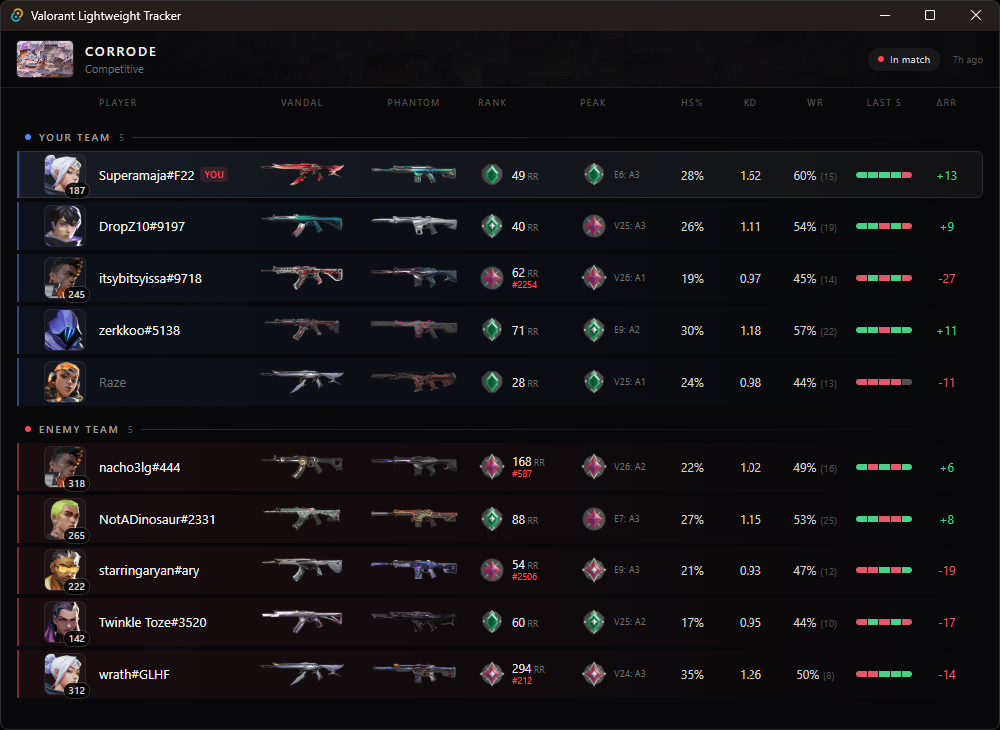

# Valorant Lightweight Tracker

A lightweight Windows desktop app that shows an **in-match player table** for
your current VALORANT match: everyone's rank, RR, peak rank, level, agent, and
per-player stats in a clean GUI.



## Why this tracker

Sites and overlay apps make you tab out, log in, or feed a heavy client just to
see who you're playing with. This is the other extreme: a single small `.exe`
that reads your own Riot client locally and puts the whole lobby in one clean
window the moment agent select opens.

- **No account, no login, no setup.** Run the exe while VALORANT is open. Done.
- **Genuinely lightweight.** A tiny native app (Tauri, Rust backend), not an
  Electron giant. It talks straight to the local Riot client and makes the
  fewest network requests it can get away with.
- **Nothing injected, no overlay.** It never touches the game process; it only
  reads the same local API the client itself exposes.

## What you see

For every player in your match:

- **Rank, RR, and peak rank** with the act it was earned in (like `E6: A3`),
  plus leaderboard placement for top Immortal+ players.
- **Headshot %, K/D, win rate, and last 5 results** from recent competitive
  matches, so you can spot the smurf before the first round.
- **Equipped Vandal and Phantom skins** for the whole lobby.
- **Agent picks live during agent select**, updating as teammates pick and lock.
- **Account level badges**, with hidden levels and incognito names respected:
  the tracker shows what Riot allows and never de-anonymizes anyone.
- **Click any player's name** to open their tracker.gg profile in your browser
  for the full match history; right-click copies their Riot id.

Everything streams in automatically: launch it once and it follows you from
menus to agent select to the match, reconnecting on its own if the game
restarts.

## Download

Grab the latest portable build from the
[**Releases page**](https://github.com/Superamaja/valorant-lightweight-tracker/releases):

1. Download `valorant-lightweight-tracker-vX.Y.Z.exe`.
2. Run it. There is **no installer**; the single `.exe` is the whole app.

### "Windows protected your PC" (SmartScreen)

The exe is unsigned, so Windows SmartScreen may warn you the first time you run
it. Click **More info -> Run anyway**. (This is expected for small unsigned
apps; the source is in this repo if you'd rather build it yourself.)

## Requirements

- **Windows 10 or 11**
- **WebView2 runtime**, preinstalled on current Windows. If missing, get it
  from Microsoft's [Evergreen WebView2](https://developer.microsoft.com/microsoft-edge/webview2/)
  page.
- **VALORANT running**. The app reads your local Riot client. Launch the game
  (menu is enough), then start the tracker; it will wait until a match begins.

## Build from source

Requires [Node.js](https://nodejs.org/) + [pnpm](https://pnpm.io/) and the
[Rust toolchain](https://www.rust-lang.org/tools/install) (Tauri 2
prerequisites).

```sh
pnpm install                    # install frontend dependencies
pnpm tauri dev                  # run the app in development (hot reload)
pnpm tauri build --no-bundle    # build the portable exe
```

The exe lands in `src-tauri/target/release/`. This is the same build the
release workflow runs; see [`docs/release.md`](docs/release.md) for how tagged
releases are built.

## Development

The UI can run against JSON snapshot data instead of a live game, including in
a plain browser with no Rust or Valorant at all. Debug builds can also capture
real snapshots to JSON while you play. See [`docs/testing.md`](docs/testing.md)
for both workflows.

## Disclaimer

This project is **not affiliated with, endorsed, sponsored, or approved by Riot
Games**. VALORANT and Riot Games are trademarks or registered trademarks of Riot
Games, Inc. It uses Riot's unofficial local client API, which can change at any
time. **Use at your own risk.**

## License

This project is source-available under the [PolyForm Noncommercial License
1.0.0](LICENSE.md): free to use, copy, and modify for noncommercial purposes.
Commercial use is not permitted. See [`LICENSE.md`](LICENSE.md) for the full
terms.

## Credits

- [**VALORANT-rank-yoinker**](https://github.com/mdevio/VALORANT-rank-yoinker)
  (ISC), the reference implementation for data correctness. This app builds its
  own backend but follows vRY's approach to the Riot endpoints.
- [**valorant-api.com**](https://valorant-api.com/), a free, no-key source for
  all static assets (agent, rank, and skin names and imagery).
